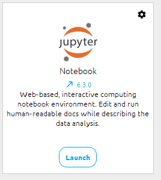

# Github_tutorial

This tutorial is here to help OpenClassrooms students from the Pole Data discord server to make their first steps with Git and GitHub. I will take the example of an analysis made in a Jupyter notebook (running with Anaconda). The analysis will be very simple to focus on the Git/GitHub work.

# 0-Introduction

I will use Jupyter on Anaconda Navigator:

I also have an account on github and created a new empty repository, with just an empty ReadMe file.

# 1-Setup our project folder

I want to work on a new branch created from this GitHub repository, where I will work on this notebook.
First, I need to create a new branch.
To do this, I will use the Terminal in my Jupyter session (more practical than using the notebook cells, I prefer putting code only in them).

- From the localhost tree tab, I click on "New - Terminal":
  

- Then, a new tab with my terminal appears.

- I check that git is correctly installed:

- Otherwise, if git is not installed yet, I can install it on Windows through this link : https://gitforwindows.org/ or use the command "conda install -c anaconda git" (https://anaconda.org/anaconda/git) to install it as a conda package (both can coexist without conflicts).

- I move into my "Documents" folder and create a new folder for this project using command line in the terminal.

- Do not forget to move into this newly created folder

- I want to init here a git repository in this folder using the "git init" command

An empty git repository is not initialized in my folder.

- We need to configure the user.email and user.name according to the email address and username used on Github (my email address is hidden here):

- Finally, we need to clone locally our project folder. We can do it using https address:

We can copy the https address directly (step 3 on the screenshot).

Then, using the command "git clone" followed by the copied address in the terminal, we clone this github repository locally in our folder.

- We can see that this created a new folder named after the name of the github repository.

- If we move in this repository, we can see our readme file (this is the only file present in our github repository).

We are now ready to work on our code !

# 3- Work on our notebook in a new branch

Imagine we want to work on our notebook and store it on github. We need to create a new branch (good practice, instead of pushing it directly on the master branch).

- I create a new branch named "new_notebook_branch". It is a good practice to create a new branch for each new feature we want to add on our code, but it also depends on different people habits and company habits if you work in a company.

- You can see that there our "main" branch (where the stable and working code is) and you new_feature branch. When in this branch, all the modifications you make locally AND push will be independent from the main branch. This means that people can work on their own branch and push code on their own branch without disturbing you, and also that the main branch can be updated with new code without disturbing you.

- With Anaconda window, I navigate to the git repository I just cloned in my "Documents/OC_git_tutorial_project/" folder:

- You can see that our locally cloned repository is here with our ReadMe file! I create a new notebook here.

- I work on my notebook and I am happy with my first lines of code. I want to push it on my branch before continuing working, so I know that a "checkpoint" (my commit) will allow me to return to this point later if I need to. I recommend the following worflow:
    - First, "git status" allows to see which files have been modified and can be added to staging area.

As you can see, I have:
- a .gitignore file in which I wrote the relative path to the original dataset folder, so every file in this folder will not be pushed on github (but we can still have it locally). It is interesting to push this file so other people that will work on the data can have the same project arborescence and put their input files in the same folder.
- a notebook checkpoint folder that it is not necessary to push
- my project notebook "Heart_Attack_prediction_example_project.ipynb" that has the first lines of code and that I want to push
- the 'input_data' folder that contains the csv input file that will not be pushed.

    - Then, "git add" the files we want to add to staging area followed by "git status" to see which files were added to staging area.
    

We can see in green the files that are in the staging area, ready to be pushed to the branch after commiting.

    - Then, "git commit -m "description of commit" " to commit the staged files. Always use a clear and short commit description, it will be useful in case you want to come back to it later.
    

We can see our commit description and which files are added in the commit.

- Finally, we can push on our branch using "git push origin branch_name". 

We now can open a pull request on our github repository with our project branch by following the indicated URL.
It is highly recommended to write a description of the PR (objective and more technical aspects such as which files are added and what they contain).

You have now your first pull request that is opened. You can see that there is no restriction to merge it on the main branch. In companies, you will certainly have rules that your code must follow to be safely added to the main branch.
This is the "Conversation" tab where the commits appear with the PR description. Comments done by pairs on your code will appear here (after they review your code).

You can visualize which files you changed in the "Files changed" tab:

You can see in green in the .gitignore file the line that has been added. If you modify a file that existed prior to your branch creation and remove some code or lines in files, they will appear in red with a little "-" indicating that your modifications include code/lines removal.
Large files modifications such as the notebook here are too large to display directly. You can always see the html output by clicking on "..." and "View file" on the top right of the document window.

I continued to work on this tutorial after several months (!) and finished the small analysis. As described before, I added my modified notebook to the staging state with "git add" and commited with an explicit description. Then, I pushed on the branch I was working on. Here is the result on github:

The second commit corresponds to the commit I just pushed. It contains the modifications I made in my notebook.

# 4 - Merge your branch with the main branch

I consider that my job is done, so in a company context I would ask my coworkers to review my work and leave comments. Then, I would take their comments into consideration to produce the best work possible. Finally, everyone would be very happy with this work and approve this pull request ! 
Since I am alone, I consider that my job is done and that I can merge this work on the main branch. There is a button on github that does it automatically:

Note that we can merge only if there are no conflicts with the main branch. This can happen when other people work on files and push them on the main branch with some modifications that you do not have on your branch yet. This can be easily resolved by a "git rebase" (this is a more intermediate git method so I will juste leave a tutorial here https://www.freecodecamp.org/news/how-to-use-git-rebase/ but feel free to ask questions on the Discord server).

After merging, I can delete my old branch since all work is now on the main branch : 

And voilà ! Now you know the basics of git and you can use it directly with Anaconda navigator and your Notebook. Feel free to make comments and ask questions on the Discord server ! I hope this helps some people to work with git and github. See you !

